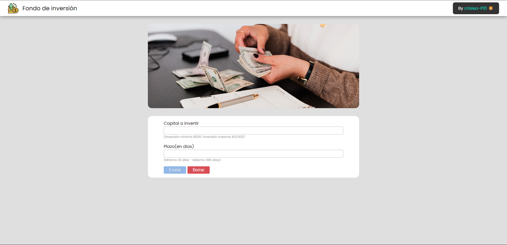
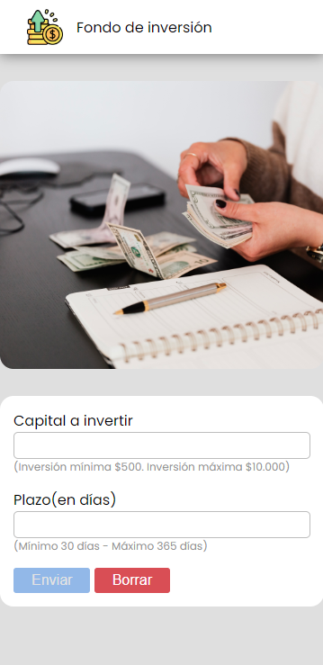

# Proyecto - Fondo de inversión

[Proyecto](https://crisleo-p01.github.io/proyecto-fondoinversion/) de un simulador de un plazo fijo, es decir, que depositas el dinero por el tiempo que se le indique y de esa manera se obtiene un interés.
El formulario consta de un input donde se ingresa el dinero que se quiere invertir y el otro input corresponde a los días que queres que ese dinero quede invertido. A más días se le coloque, el rendimiento de inversión es mayor.

Por otro lado el funcionamiento del botón de **enviar** funciona dependiendo de que si ambos inputs cumplen con los requisitos que se les pide que coloque. El campo de **Capital a invertir** tiene un mínimo de $500 y un máximo de $10.000. En tanto el campo de **Plazo(en días)** tiene un mínimo de 30 días y un máximo de 365 días. Si uno de los campos o ambos no cumplen con el requisito que se pide, el botón **enviar** no se activará. Por el contrario, si ambos campos cumplen con los requisitos que se pide, el botón **enviar** es activado y de esa forma se despliega una tabla en donde se podrá observar un resumen de los datos colocados en ambos inputs, como así también el rendimiento de inversión que se obtiene más el monto total **(capital invertido + plazo en días)**.

El sitio web es responsive, es decir, que se puede visualizar tanto en desktop como el mobile.

